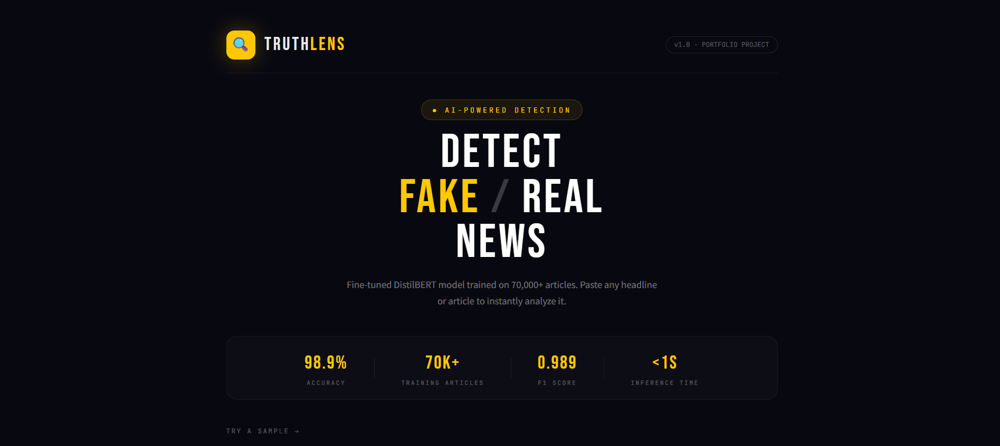
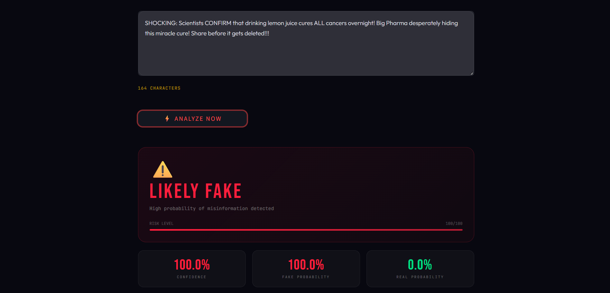
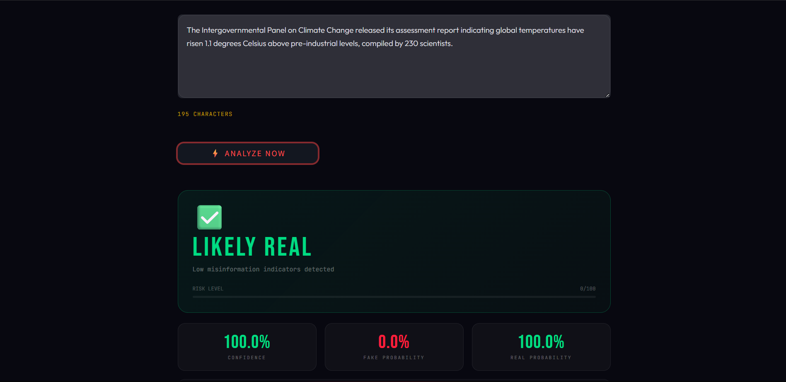

# 🔍 TruthLens — AI-Powered Fake News Detector

> Fine-tuned DistilBERT model that classifies news as real or fake with **98.9% accuracy**, featuring SHAP-based explainability, FastAPI backend, and a live Streamlit deployment.

[](https://huggingface.co/distilbert-base-uncased)
[](https://huggingface.co/datasets/GonzaloA/fake_news)
[]()
[]()
[]()
[]()

---

## 🎯 What It Does

TruthLens takes any news article or headline and:
- **Classifies** it as FAKE or REAL using a fine-tuned DistilBERT model
- **Explains** *why* using SHAP word-level attribution scores
- **Scores** multiple linguistic signals (capitalization, tone, sensational language, factual language)
- **Displays** results in a clean, interactive Streamlit UI
- **Serves** predictions via a REST API built with FastAPI

---

## 🚀 Live Demo

> (https://huggingface.co/spaces/ReizenO8/truthlens)

---

## 📊 Model Performance

| Model | Accuracy | F1 Score |
|---|---|---|
| Baseline (TF-IDF + Logistic Regression) | 74.2% | 0.741 |
| **DistilBERT fine-tuned (WELFake)** | **98.9%** | **0.9887** |

Trained on the [WELFake dataset](https://huggingface.co/datasets/GonzaloA/fake_news) — 70,000+ labeled news articles.

---

## 🖥️ Screenshots

### Main Interface


### Fake News Detection


### Real News Detection


### SHAP Explainability


### FastAPI Docs


---

## 🏗️ Project Structure

```
truthlens/
├── notebooks/
│   ├── 01_eda.ipynb                    # Dataset exploration & cleaning
│   ├── 02_baseline.ipynb               # TF-IDF + Logistic Regression baseline
│   ├── 03_distilbert_finetune.ipynb    # DistilBERT fine-tuning (main model)
│   └── 04_explainability.ipynb         # SHAP word-level explanations
├── api/
│   └── main.py                         # FastAPI REST endpoint
├── app/
│   └── streamlit_app.py                # Full Streamlit UI
├── requirements.txt
└── README.md
```

---

## ⚙️ Tech Stack

| Component | Technology |
|---|---|
| Core Model | DistilBERT-base-uncased (HuggingFace Transformers) |
| Baseline | TF-IDF + Logistic Regression (Scikit-learn) |
| Explainability | SHAP |
| API | FastAPI + Uvicorn |
| Frontend | Streamlit |
| Dataset | WELFake (70,000+ articles) |
| Training | Google Colab T4 GPU |

---

## 🛠️ Run Locally

### 1. Clone the repository
```bash
git clone https://github.com/heyvishal08/truthlens.git
cd truthlens
```

### 2. Install dependencies
```bash
pip install -r requirements.txt
```

### 3. Download the trained model
The model is not included in this repo due to file size.
Train it yourself using `notebooks/03_distilbert_finetune.ipynb` on Google Colab (free T4 GPU, ~40 mins).

Or download the pre-trained model from HuggingFace: *(link coming soon)*

Place the downloaded `saved_model/` folder in the root directory.

### 4. Start the FastAPI backend
```bash
python -m uvicorn api.main:app --reload
```
API running at: `http://localhost:8000`
Interactive docs: `http://localhost:8000/docs`

### 5. Start the Streamlit frontend
```bash
python -m streamlit run app/streamlit_app.py
```
Opens at: `http://localhost:8501`

---

## 🧠 How It Works

```
Input Text
    │
    ▼
DistilBERT Tokenizer (max 256 tokens)
    │
    ▼
Fine-tuned DistilBERT-base-uncased
(trained 4 epochs, lr=2e-5, fp16, T4 GPU)
    │
    ▼
Softmax → [P(FAKE), P(REAL)]
    │
    ├── SHAP Explainer → word-level attributions
    └── Rule-based signals → linguistic heuristics
    │
    ▼
Final Verdict + Confidence Score + Signal Breakdown
```

---

## 🔬 Training Details

| Parameter | Value |
|---|---|
| Base Model | distilbert-base-uncased |
| Dataset | WELFake (GonzaloA/fake_news) |
| Train Size | ~56,000 articles |
| Max Token Length | 256 |
| Epochs | 4 |
| Learning Rate | 2e-5 |
| Batch Size | 32 |
| Hardware | Google Colab T4 GPU |
| Training Time | ~40 minutes |

---

## 📈 Key Learnings

- Fine-tuning a pre-trained transformer on a large dataset (70K articles) achieves near-perfect accuracy
- Short headlines (< 20 words) are harder to classify than full articles due to limited linguistic signal
- SHAP explanations reveal that exclamation marks, words like "SHOCKING", "BREAKING", "miracle" are the strongest fake news indicators
- A simple TF-IDF baseline at 74% shows how much pre-trained language understanding adds (+24%)
- The LIAR dataset (short political statements) is genuinely difficult — even published research gets ~65%, highlighting dataset choice importance

---

## ⚠️ Limitations

- Model trained on pre-2024 data — may misclassify very recent breaking news
- Short headlines (< 20 words) have lower accuracy than full articles
- Does not verify facts against external sources or knowledge bases
- Optimized for English language only
- Future improvement: RAG-based fact checking against live news APIs

---

## 📁 Sample Predictions

| Text | Prediction | Confidence |
|---|---|---|
| "SHOCKING: Scientists confirm miracle cure hidden by Big Pharma!!!" | ⚠️ FAKE | 100% |
| "WHO reports 12% increase in vaccination rates in developing nations" | ✅ REAL | 99.5% |
| "BREAKING: Government secretly poisoning water supply! Share before deleted!!!" | ⚠️ FAKE | 100% |
| "Apple reported quarterly revenue of $89.5 billion, services segment up 16%" | ✅ REAL | 98.2% |

---


## 📬 Contact

**Vishal Gupta** · MSc AI Engineering Applicant
🔗 [GitHub](https://github.com/heyvishal08)

---

## 📄 License

MIT License — free to use, modify, and distribute.

---


